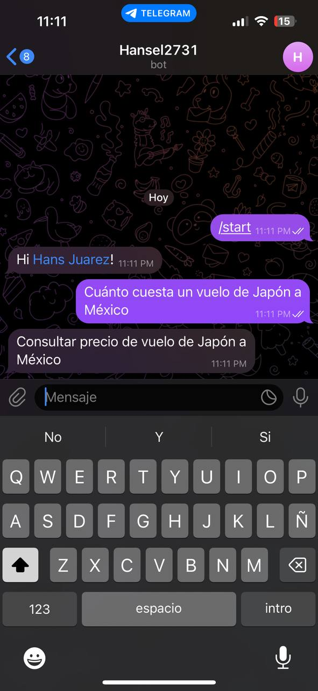
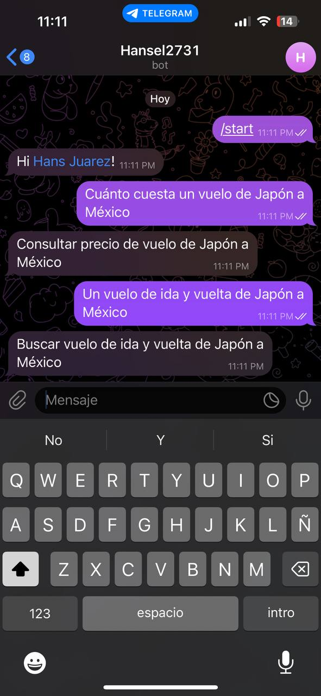
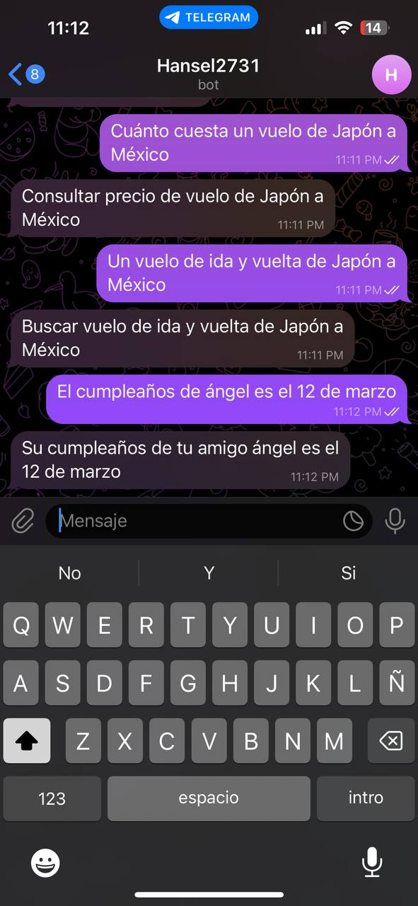
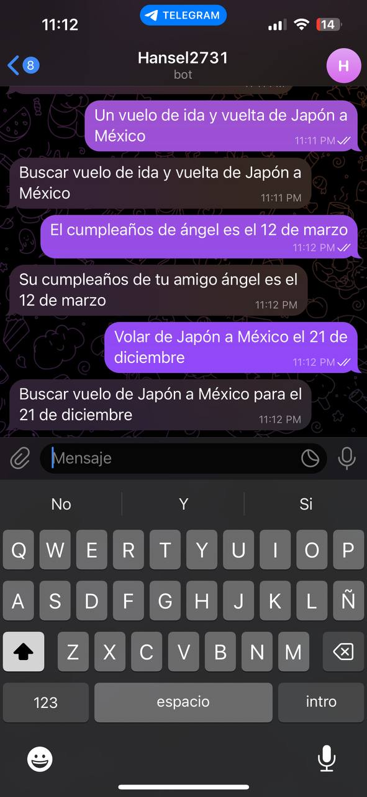
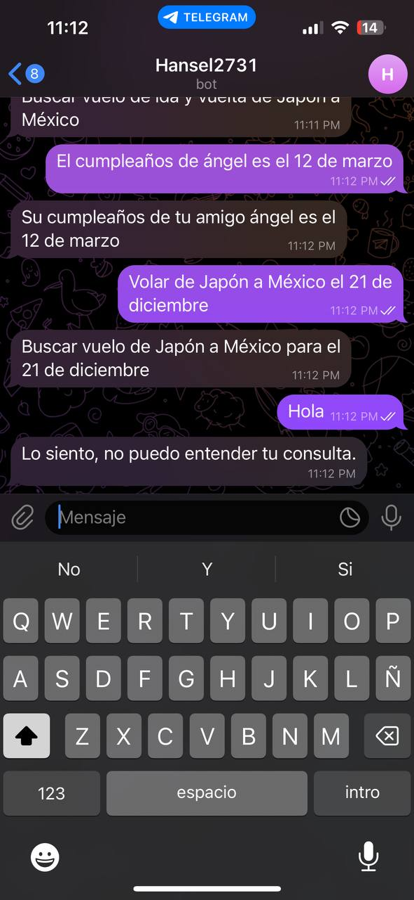

  
# Evidencia Del Bot

Primero ponemos la primera expresión regular que nos proporciono el profe que fue la siguiente:

Esta es la segunda expresión regular que nos proporciono el profe:

Estas expresión fue incluida por nosotros:

La ultima expresión que nos dio el profesor:

Respuesta alternativa:

